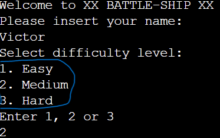

# XX BATTLE-SHIP XX

Git Hub page:
https://github.com/hugoht3/battle-ship

Heroku Mock terminal:  
https://xxbattle-shipxx-618349b2d0ae.herokuapp.com/

Battleship Game
Welcome to XX BATTLE-SHIP XX
This is a terminal-based Battleship game where you face off against an AI opponent. The game includes a player and an AI enemy that take turns guessing the location of hidden ships on a grid. The player wins by sinking all enemy ships before running out of turns.

# Features

## Random board generation

## A difficulty selector (1. Easy 2.Medium 3.Hard)

The difficulty alters the size of the board as the number of ships.

## Turn Counter

## A character marker as in a 

### (0) Represents the board

### ($) Represents user`s ship's

### (X) Represents a hit

### (@) Represents a Miss

## Testing

+ Passed the code trough a PEP8 linter for the 100% Clear

+ Given invalid inputs are not going trough as the validator`s work

+ Heroku's mock terminal start and finishes the game as intended

## Deployment
Files are deployed to Git hub :https://github.com/hugoht3/battle-ship

Also deployed to Heroku for use the use of Mock terminal,
provided by CODE INSTITUTE :https://xxbattle-shipxx-618349b2d0ae.herokuapp.com/

> Steps:

+ Clone the Repository: https://github.com/Code-Institute-Org/p3-template

+ Created a Heroku, Set the buildbacks to Python and NodeJS in that particular order 

+ Link the Git Hub repository to Heroku

+ Clicked deploy

## Credits
+ No Libraries Where used in this project
    
+ CODE INSTITUTE had all the information and the tools provided for the completion of this project:
    
https://codeinstitute.net/ie/full-stack-software-development-diploma/?utm_term=code%20institute&utm_campaign=CI+-+IRL+-+Search+-+Brand&utm_source=adwords&utm_medium=ppc&hsa_acc=8983321581&hsa_cam=14304747355&hsa_grp=128775288209&hsa_ad=635725005315&hsa_src=g&hsa_tgt=kwd-319867646331&hsa_kw=code%20institute&hsa_mt=e&hsa_net=adwords&hsa_ver=3&gad_source=1&gclid=CjwKCAjw9cCyBhBzEiwAJTUWNXtXZKdc0zk_YotoZCaKjzIgR_JQKAyrdHm0yR2HqGeNGb9gyPywLBoCBGIQAvD_BwE

### Redeployment 
    Improve code readebility

# Corrected some user inputs :
    Where as the player could before make the same move twice.
    The same as for the computer guess

# Board 
    Made the board stop showing the enemy ships

